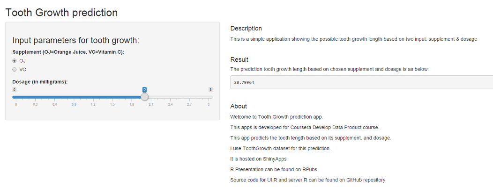

## Introduction

This presentation is part of coursera Develop Data Product course. The project comes with two parts:

1. Shiny app
2. R Presentation describing Shiny apps.

It is hosted on [ShinyApps](http://www.google.com).

R Presentation can be found on [RPubs](http://www.google.com).

Source code for UI.R and server.R can be found on [my GitHub repository](http://www.google.com).

---

## ToothGrowth Dataset

The ToothGrowth dataset aims to analyse "The Effect of Vitamin C on Tooth Growth in Guinea Pigs".

Description

The response is the length of odontoblasts (teeth) in each of 10 guinea pigs at each of three dose levels of Vitamin C (0.5, 1, and 2 mg) with each of two delivery methods (orange juice or ascorbic acid).


```r
head(ToothGrowth)
```

```
##    len supp dose
## 1  4.2   VC  0.5
## 2 11.5   VC  0.5
## 3  7.3   VC  0.5
## 4  5.8   VC  0.5
## 5  6.4   VC  0.5
## 6 10.0   VC  0.5
```

---

## App Instruction
This is a simple application showing the possible tooth growth length based on two input: supplement & dosage.

You may change the value by clicking radio button (for supp) and slider bar (for dose).

---

## Sample screen
This is the sample screen for the predictor apps



